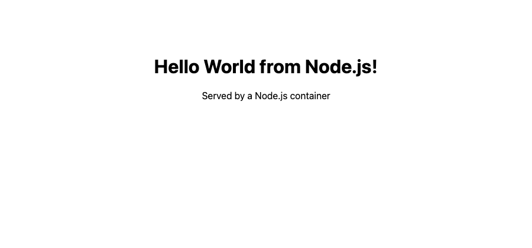
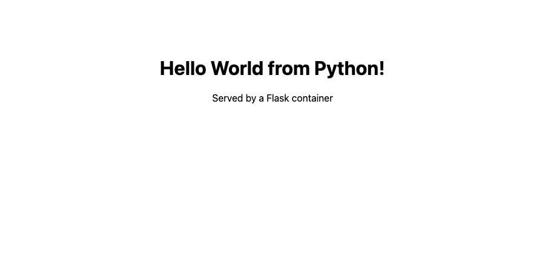
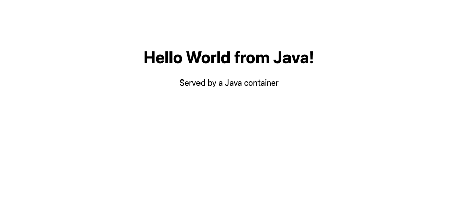
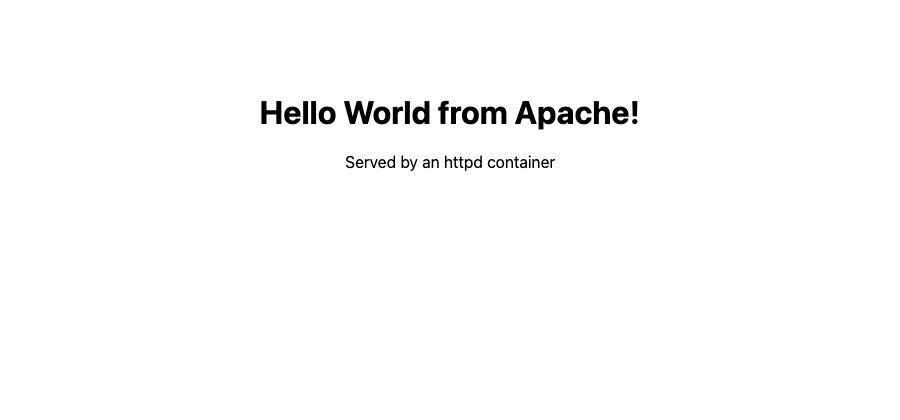
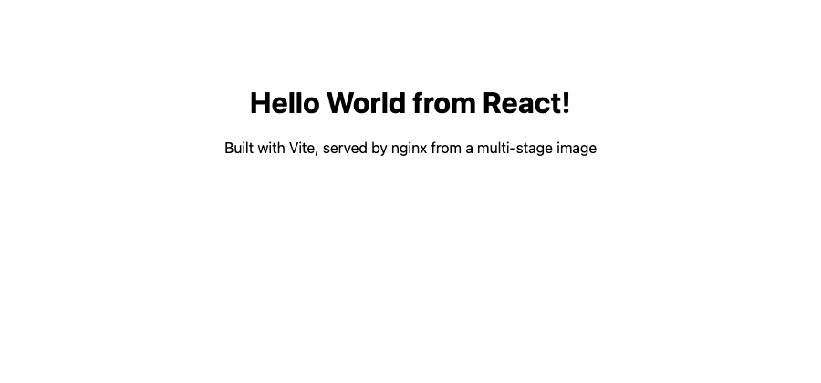
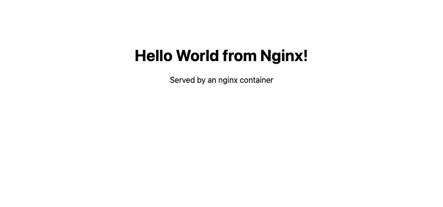

# Docker Fundamentals — Hello World Applications

Six Hello World web applications, one per folder, each with its own Dockerfile. Every image
was built and run locally on Docker Desktop 29.5.2 (macOS, arm64), and every page was opened
in a browser to confirm the greeting renders.

| Folder | Base image | Container port | Host port | Final image size |
|---|---|---|---|---|
| `nodejs-app/` | `node:22-alpine` | 3000 | 3001 | 232 MB |
| `python-app/` | `python:3.13-slim` | 5000 | 3002 | 234 MB |
| `java-app/` | `eclipse-temurin:21-jdk-alpine` | 8080 | 3003 | 555 MB |
| `Apache-app/` | `httpd:2.4-alpine` | 80 | 3004 | 105 MB |
| `React-app/` | `node:22-alpine` → `nginx:1.27-alpine` | 80 | 3005 | 76.1 MB |
| `nginx-app/` | `nginx:1.27-alpine` | 80 | 3006 | 75.9 MB |

Each app was given a different host port so all six could run at the same time and be
compared side by side.

## Build and run

```bash
# built from the 05-docker-fundamentals/ directory
docker build -t hw-nodejs-app ./nodejs-app
docker build -t hw-python-app ./python-app
docker build -t hw-java-app   ./java-app
docker build -t hw-apache-app ./Apache-app
docker build -t hw-react-app  ./React-app
docker build -t hw-nginx-app  ./nginx-app

docker run -d --name hw-nodejs -p 3001:3000 hw-nodejs-app
docker run -d --name hw-python -p 3002:5000 hw-python-app
docker run -d --name hw-java   -p 3003:8080 hw-java-app
docker run -d --name hw-apache -p 3004:80   hw-apache-app
docker run -d --name hw-react  -p 3005:80   hw-react-app
docker run -d --name hw-nginx  -p 3006:80   hw-nginx-app
```

### `docker images`

```
REPOSITORY      TAG       SIZE
hw-nginx-app    latest    75.9MB
hw-react-app    latest    76.1MB
hw-apache-app   latest    105MB
hw-java-app     latest    555MB
hw-python-app   latest    234MB
hw-nodejs-app   latest    232MB
```

### `docker ps` — all six running at once

```
NAMES       IMAGE           STATUS              PORTS
hw-nginx    hw-nginx-app    Up About a minute   0.0.0.0:3006->80/tcp, [::]:3006->80/tcp
hw-react    hw-react-app    Up About a minute   0.0.0.0:3005->80/tcp, [::]:3005->80/tcp
hw-apache   hw-apache-app   Up About a minute   0.0.0.0:3004->80/tcp, [::]:3004->80/tcp
hw-java     hw-java-app     Up About a minute   0.0.0.0:3003->8080/tcp, [::]:3003->8080/tcp
hw-python   hw-python-app   Up About a minute   0.0.0.0:3002->5000/tcp, [::]:3002->5000/tcp
hw-nodejs   hw-nodejs-app   Up About a minute   0.0.0.0:3001->3000/tcp, [::]:3001->3000/tcp
```

### Verification with `curl`

```bash
for p in 3001 3002 3003 3004 3005 3006; do
  printf "port %s -> HTTP %s : " "$p" "$(curl -s -o /dev/null -w '%{http_code}' http://localhost:$p)"
  curl -s http://localhost:$p | grep -o '<h1>[^<]*</h1>' | head -1
done
```

```
port 3001 -> HTTP 200 : <h1>Hello World from Node.js!</h1>
port 3002 -> HTTP 200 : <h1>Hello World from Python!</h1>
port 3003 -> HTTP 200 : <h1>Hello World from Java!</h1>
port 3004 -> HTTP 200 : <h1>Hello World from Apache!</h1>
port 3005 -> HTTP 200 :
port 3006 -> HTTP 200 : <h1>Hello World from Nginx!</h1>
```

Port 3005 (React) returns `200` but no `<h1>` in the response body. That is the expected
result, not a failure: nginx serves the Vite `index.html`, which is an empty
`<div id="root">`, and React writes the heading into it in the browser. `curl` does not run
JavaScript, so the heading only appears once a real browser executes the bundle — which the
screenshot below confirms.

## The six applications

### `nodejs-app/` — Node.js on port 3001

Plain `http` module rather than Express, so the image needs no dependencies at all. The
Dockerfile still copies `package*.json` and runs `npm install` before copying the source, so
that the dependency layer is cached independently of the application code — the ordering
matters as soon as a real dependency is added.



### `python-app/` — Flask on port 3002

Flask bound to `0.0.0.0` rather than the default `127.0.0.1`. This is the single most common
mistake with containerised web apps: bound to loopback, the server is only reachable from
*inside* the container's own network namespace, and the published port answers with a
connection reset.



### `java-app/` — JDK HTTP server on port 3003

Uses the built-in `com.sun.net.httpserver.HttpServer`, so there is no Maven or Gradle build.
Java 11 and later can execute a single-file source program directly, so the whole Dockerfile
is `COPY Main.java` plus `CMD ["java", "Main.java"]`.

This is also the largest image at 555 MB, because it ships a full JDK to run one class. The
obvious fix is a multi-stage build that compiles with the JDK and ships only a JRE — which is
exactly the exercise in `../06-dockerfiles-and-images/`.



### `Apache-app/` — httpd on port 3004

Nothing but `COPY index.html /usr/local/apache2/htdocs/`. The official `httpd` image already
has the right `DocumentRoot` and a foreground `CMD`, so no configuration is needed.



### `React-app/` — Vite build served by nginx on port 3005

The only app of the six that needs a real build step, so it uses a two-stage Dockerfile:

1. `node:22-alpine` installs the dependencies and runs `npm run build` into `dist/`.
2. `nginx:1.27-alpine` receives only `dist/` via `COPY --from=builder`.

Node and `node_modules` never reach the final image. The result is 76.1 MB — smaller than
the 232 MB plain-Node app, even though this one has React, Vite and a build toolchain
involved in producing it.



### `nginx-app/` — static nginx on port 3006

The baseline: static HTML copied into `/usr/share/nginx/html/`. At 75.9 MB it is the
smallest image here, and it is what the React app compiles down to.



## What stood out

- **Image size follows what you ship, not what the app does.** All six serve one HTML page.
  The spread is 76 MB to 555 MB, decided entirely by whether a language runtime or a whole
  toolchain ends up in the final layer.
- **A multi-stage build is not only for compiled languages.** The React app has the heaviest
  build of the six and the second-smallest image.
- **Bind to `0.0.0.0`.** `-p` publishes a port on the host, but it cannot help if the process
  inside is only listening on loopback.
- **`curl` is not a browser.** A 200 with no visible content is the normal signature of a
  client-rendered app, and worth recognising before assuming the container is broken.

## Cleanup

```bash
docker rm -f hw-nodejs hw-python hw-java hw-apache hw-react hw-nginx
docker rmi hw-nodejs-app hw-python-app hw-java-app hw-apache-app hw-react-app hw-nginx-app
```
