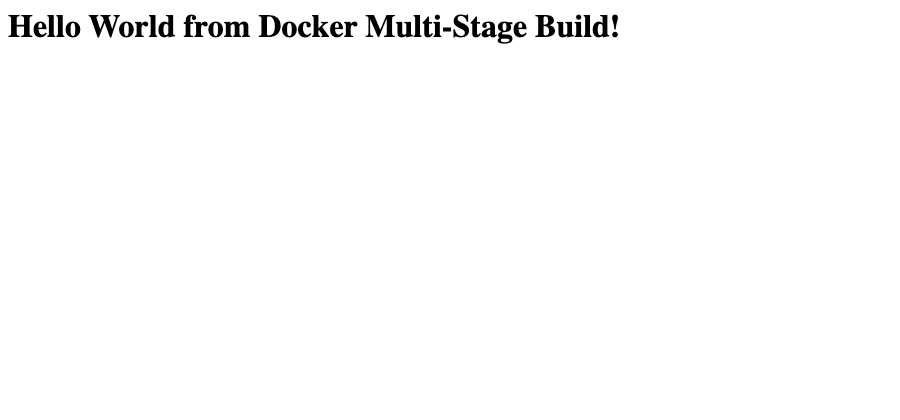

# Dockerfiles & Images — Multi-Stage Build

**Name:** Anisha Singhal
**Enrollment number:** 10020
**Environment:** macOS (arm64), Docker Desktop 29.5.2

## Task 1 — Build and run the provided multi-stage Dockerfile

The Dockerfile came from the course repo
([`devops-heros/session6-7-docker/multi-stage-dockerfile`](https://github.com/Nency-Ravaliya/devops-heros/tree/main/session6-7-docker/multi-stage-dockerfile))
and is reproduced unchanged in `multi-stage-app/`. It is an Express app that serves one line
of HTML.

```bash
docker build -t hw-multistage ./multi-stage-app
docker run -d --name hw-multistage -p 8080:3000 hw-multistage
```

The app listens on **3000** inside the container, so it is published as `-p 8080:3000` to
meet the "running on port 8080" requirement. The host port and the container port do not have
to match, and this is the normal way to satisfy a fixed external port.

### `docker ps` — container running on port 8080

```
NAMES           IMAGE           STATUS         PORTS
hw-multistage   hw-multistage   Up 4 seconds   0.0.0.0:8080->3000/tcp, [::]:8080->3000/tcp
```

### Application response

```bash
curl -i http://localhost:8080
```

```
HTTP/1.1 200 OK
X-Powered-By: Express
Content-Type: text/html; charset=utf-8
Content-Length: 51
ETag: W/"33-gCAsBJJtlso/BVPWoV3U/pWC3Ak"
Date: Thu, 03 Sep 2026 16:56:26 GMT
Connection: keep-alive
Keep-Alive: timeout=5

<h1>Hello World from Docker Multi-Stage Build!</h1>
```

Container logs confirm the process came up cleanly:

```
> docker-hello-world@1.0.0 start
> node server.js

Server running on port 3000
```



## Task 2 — How much did the multi-stage build actually save?

The Dockerfile has two stages, so the interesting question is what the second stage avoids
shipping. To measure it rather than assume it, I wrote the equivalent single-stage Dockerfile
for the same app and built both:

```dockerfile
FROM node:24-alpine
WORKDIR /app
COPY package*.json ./
RUN npm install
COPY . .
EXPOSE 3000
CMD ["npm", "start"]
```

```
hw-singlestage   249MB
hw-multistage    243MB
```

**6 MB, about 2%.** Almost nothing — and that result is worth understanding rather than
glossing over. Two reasons:

1. **Both stages use the same base image** (`node:24-alpine`). Multi-stage saves space by
   letting the runtime stage start from something *smaller* than the build stage. When both
   start from the same 240 MB image, the floor is already 240 MB.
2. **The app has no `devDependencies`.** The production stage runs `npm install --omit=dev`,
   but `package.json` lists only `express`, so there is nothing for `--omit=dev` to drop.

The pattern in the Dockerfile is correct and it is what you want in place before the project
grows — once TypeScript, a bundler or a test framework are in `devDependencies`, that same
Dockerfile starts paying off without further changes. But on this app, as written today, the
saving is marginal.

### What it looks like when the stages genuinely differ

To show the mechanism working properly, `java-multi-stage/` rebuilds the Java app from
`../05-docker-fundamentals/java-app/` — which ships a whole JDK to run one class — as a
JDK-builds / JRE-runs pair:

```dockerfile
FROM eclipse-temurin:21-jdk-alpine AS builder
WORKDIR /build
COPY Main.java ./
RUN javac -d out Main.java

FROM eclipse-temurin:21-jre-alpine
WORKDIR /app
COPY --from=builder /build/out ./
EXPOSE 8080
CMD ["java", "Main"]
```

```
hw-java-app          555MB   # single stage, JDK at runtime
hw-java-multistage   286MB   # compiled in the JDK, runs on the JRE
```

**269 MB saved, a 48% reduction**, verified still working:

```bash
$ curl -s http://localhost:8081 | grep -o '<h1>[^<]*</h1>'
<h1>Hello World from Java!</h1>
```

The compiler and the rest of the JDK tooling stay in stage 1. Only the `.class` file crosses
the `COPY --from=builder` boundary. Same source, same behaviour, half the image — and a
smaller attack surface, since a shipped compiler is one more thing an attacker can use.

## Task 3 — Deploy three different application types

Node.js, Python and Java were each built and deployed as containers (sources in
`../05-docker-fundamentals/`), running simultaneously alongside the multi-stage builds:

```
NAMES           IMAGE                STATUS              PORTS
hw-java-ms      hw-java-multistage   Up 10 seconds       0.0.0.0:8081->8080/tcp, [::]:8081->8080/tcp
hw-multistage   hw-multistage        Up About a minute   0.0.0.0:8080->3000/tcp, [::]:8080->3000/tcp
hw-nginx        hw-nginx-app         Up 3 minutes        0.0.0.0:3006->80/tcp, [::]:3006->80/tcp
hw-react        hw-react-app         Up 3 minutes        0.0.0.0:3005->80/tcp, [::]:3005->80/tcp
hw-apache       hw-apache-app        Up 3 minutes        0.0.0.0:3004->80/tcp, [::]:3004->80/tcp
hw-java         hw-java-app          Up 3 minutes        0.0.0.0:3003->8080/tcp, [::]:3003->8080/tcp
hw-python       hw-python-app        Up 3 minutes        0.0.0.0:3002->5000/tcp, [::]:3002->5000/tcp
hw-nodejs       hw-nodejs-app        Up 3 minutes        0.0.0.0:3001->3000/tcp, [::]:3001->3000/tcp
```

Eight containers, five languages/runtimes, each isolated on its own published port. All
verified returning HTTP 200 with the expected greeting — the per-app screenshots are in
[`../05-docker-fundamentals/README.md`](../05-docker-fundamentals/README.md).

### Every image built for this assignment, by size

```
hw-nginx-app          75.9MB
hw-react-app          76.1MB    <- multi-stage: Vite build -> nginx
hw-apache-app         105MB
hw-nodejs-app         232MB
hw-python-app         234MB
hw-multistage         243MB     <- multi-stage: same base both stages
hw-singlestage        249MB
hw-java-multistage    286MB     <- multi-stage: JDK -> JRE
hw-java-app           555MB
```

## What I took away

- **`-p 8080:3000` is the answer to "must run on port 8080."** The container port belongs to
  the app; the host port is a deployment decision.
- **Multi-stage is a mechanism, not a guarantee.** The saving comes from the runtime stage
  starting smaller than the build stage. Same base for both stages, and there is nothing to
  gain — 2% here versus 48% on the Java app, from the identical technique.
- **Measure the claim.** "Multi-stage makes images smaller" was true on two of my three
  builds and effectively false on the third. Building the single-stage comparison took two
  minutes and turned an assumption into a number.
- **The React app is the case worth remembering** — the heaviest build of anything here and
  the second-smallest image, because `COPY --from` took the compiled output and left the
  entire toolchain behind.

## Cleanup

```bash
docker rm -f hw-multistage hw-java-ms
docker rmi hw-multistage hw-singlestage hw-java-multistage
```
