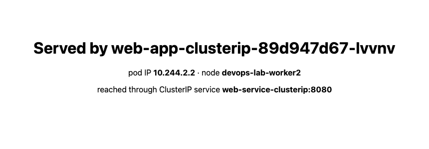

# ClusterIP — Internal Service Discovery

Worked through the `01-clusterip` exercise from the course repo. Every command below was run
and the output is real.

**Cluster:** `kind` v0.30.0, Kubernetes **v1.34.0**, 1 control-plane + 2 workers, on Docker
Desktop (macOS arm64). A multi-node cluster was used on purpose so the 3 replicas land on
different nodes — a single-node cluster hides the most interesting part of what a Service does.

```bash
kind create cluster --config kind-cluster.yaml    # 1 control-plane, 2 workers
```

```
NAME                       STATUS   ROLES           VERSION
devops-lab-control-plane   Ready    control-plane   v1.34.0
devops-lab-worker          Ready    <none>          v1.34.0
devops-lab-worker2         Ready    <none>          v1.34.0
```

The API server allocates ClusterIPs from `--service-cluster-ip-range=10.96.0.0/16`, which is
where the `10.96.x.x` address below comes from.

## Step 1 — Deploy the backend

```bash
kubectl apply -f app-deployment.yaml
kubectl get pods -l app=web-clusterip -o wide
```

```
NAME                                READY   STATUS    IP           NODE
web-app-clusterip-89d947d67-28lt8   1/1     Running   10.244.1.3   devops-lab-worker
web-app-clusterip-89d947d67-lvvnv   1/1     Running   10.244.2.2   devops-lab-worker2
web-app-clusterip-89d947d67-pgnqs   1/1     Running   10.244.1.2   devops-lab-worker
```

Three pods, three different IPs, spread over two nodes. Note the IPs are on `10.244.0.0/16`
(the pod network) — a completely different range from the service network.

## Step 2 — Create the Service

```bash
kubectl apply -f service.yaml
kubectl get svc web-service-clusterip
```

```
NAME                    TYPE        CLUSTER-IP     EXTERNAL-IP   PORT(S)    AGE
web-service-clusterip   ClusterIP   10.96.94.101   <none>        8080/TCP   0s
```

`EXTERNAL-IP` is `<none>`, and that is the definition of a ClusterIP service — there is no
route in from outside. Proven below.

## Step 3 — Endpoints

```bash
kubectl get endpoints web-service-clusterip
```

```
Warning: v1 Endpoints is deprecated in v1.33+; use discovery.k8s.io/v1 EndpointSlice
NAME                    ENDPOINTS                                   AGE
web-service-clusterip   10.244.1.2:80,10.244.1.3:80,10.244.2.2:80   0s
```

It still works, but **Kubernetes 1.34 prints a deprecation warning** — `v1 Endpoints` is
deprecated from 1.33. The current object is `EndpointSlice`, which scales better because a
service with thousands of pods no longer needs one enormous object:

```bash
kubectl get endpointslices -l kubernetes.io/service-name=web-service-clusterip
```

```
10.244.1.3  ready=true  node=devops-lab-worker
10.244.2.2  ready=true  node=devops-lab-worker2
10.244.1.2  ready=true  node=devops-lab-worker
```

All three pod IPs bound, each marked `ready`. **`ready` is the field that matters** — a pod
that is `Running` but failing its readiness probe is removed from this list and stops
receiving traffic, without the Service or the ClusterIP changing at all.

## Step 4 — Reaching the service from inside

```bash
kubectl apply -f client-pod.yaml
```

### Test 1 — by service name

```bash
$ kubectl exec curl-client -- curl -s http://web-service-clusterip:8080
<!DOCTYPE html>
<html>
<head>
<title>Welcome to nginx!</title>
```

### Test 2 — by ClusterIP

```bash
$ kubectl exec curl-client -- curl -s http://10.96.94.101:8080 | grep -E '<title>|<h1>'
<title>Welcome to nginx!</title>
<h1>Welcome to nginx!</h1>
```

### Test 3 — by FQDN

```bash
$ kubectl exec curl-client -- curl -s http://web-service-clusterip.default.svc.cluster.local:8080 | grep -E '<title>|<h1>'
<title>Welcome to nginx!</title>
<h1>Welcome to nginx!</h1>
```

All three routes work. The reason the short name resolves is in the pod's resolver config:

```bash
$ kubectl exec curl-client -- cat /etc/resolv.conf
search default.svc.cluster.local svc.cluster.local cluster.local
nameserver 10.96.0.10
options ndots:5
```

`nameserver 10.96.0.10` is CoreDNS — itself a ClusterIP service. The `search` list is what
turns `web-service-clusterip` into the FQDN, and it is tried **in order**:

```bash
$ kubectl exec curl-client -- nslookup web-service-clusterip
Server:		10.96.0.10
Address:	10.96.0.10:53

** server can't find web-service-clusterip.cluster.local: NXDOMAIN
** server can't find web-service-clusterip.svc.cluster.local: NXDOMAIN

Name:	web-service-clusterip.default.svc.cluster.local
Address: 10.96.94.101

command terminated with exit code 1
```

Worth reading carefully, because this looks like a failure and is not. The `NXDOMAIN` lines
are the resolver trying the *other* search domains, which legitimately do not exist. The
answer is in the middle: `10.96.94.101`. `nslookup` still exits **1** because some of its
queries returned NXDOMAIN — so **an exit code from `nslookup` is not a reliable test of
whether a name resolves.** Read the output, not the status.

`options ndots:5` is the other half: any name with fewer than 5 dots gets the search list
appended before being tried as-is. That is why `web-service-clusterip` works, and also why
every external lookup from a pod costs several wasted DNS queries first.

## Does it actually load-balance?

The exercise asserts that kube-proxy load-balances across pods but never shows it — stock
nginx returns an identical page from every pod, so you cannot tell them apart. I gave each pod
a page naming itself, then sent 60 requests:

```bash
for p in $(kubectl get pods -l app=web-clusterip -o name); do
  kubectl exec ${p#pod/} -- sh -c "echo 'SERVED-BY ${p#pod/}' > /usr/share/nginx/html/index.html"
done

kubectl exec curl-client -- sh -c 'for i in $(seq 1 60); do curl -s http://web-service-clusterip:8080; done' \
  | sort | uniq -c | sort -rn
```

```
  24 SERVED-BY web-app-clusterip-89d947d67-lvvnv (10.244.2.2)
  19 SERVED-BY web-app-clusterip-89d947d67-pgnqs (10.244.1.2)
  17 SERVED-BY web-app-clusterip-89d947d67-28lt8 (10.244.1.3)
```

All three pods served traffic, across both worker nodes. But the split is 24/19/17, not
20/20/20 — and the reason is visible in the actual implementation.

## How it works underneath

`kube-proxy` runs in `iptables` mode here. The Service is not a process — there is nothing
listening on `10.96.94.101`. It is a set of NAT rules on every node:

```bash
$ docker exec devops-lab-worker iptables-save -t nat | grep web-service-clusterip
```

```
-A KUBE-SERVICES -d 10.96.94.101/32 -p tcp --dport 8080 -j KUBE-SVC-TIXQXGX7DUC52XEM

-A KUBE-SVC-TIXQXGX7DUC52XEM -m statistic --mode random --probability 0.33333333349 -j KUBE-SEP-N7AQS7PSLC2ANU4E
-A KUBE-SVC-TIXQXGX7DUC52XEM -m statistic --mode random --probability 0.50000000000 -j KUBE-SEP-HISBDBF4C6H2TMX6
-A KUBE-SVC-TIXQXGX7DUC52XEM -j KUBE-SEP-ILC2K5VFJ37PECPW

-A KUBE-SEP-N7AQS7PSLC2ANU4E -p tcp -j DNAT --to-destination 10.244.1.2:80
-A KUBE-SEP-HISBDBF4C6H2TMX6 -p tcp -j DNAT --to-destination 10.244.1.4:80
-A KUBE-SEP-ILC2K5VFJ37PECPW -p tcp -j DNAT --to-destination 10.244.2.2:80
```

Read top to bottom, this is the whole mechanism:

1. Traffic to `10.96.94.101:8080` jumps to the service chain.
2. That chain picks a backend by **probability**: ⅓ to the first, then ½ of what remains to
   the second, then the rest to the third. That is 1/3, 1/3, 1/3.
3. The chosen chain `DNAT`s the packet to a real pod IP on port 80.

**This explains the 24/19/17.** It is not round-robin — it is an independent random draw per
connection. Over 60 requests, that spread is exactly what you would expect. It also means
sequential requests from one client can hit the same pod repeatedly; there is no fairness
guarantee, only a statistical one.

It also explains why the `port` / `targetPort` split exists: `--dport 8080` matches the
service port, `--to-destination :80` is the container port. The translation is a DNAT rule.

## The problem it solves, demonstrated

The exercise explains that pod IPs are ephemeral. Here is that happening:

```bash
# BEFORE
ClusterIP: 10.96.94.101
web-app-clusterip-89d947d67-28lt8   10.244.1.3
web-app-clusterip-89d947d67-lvvnv   10.244.2.2
web-app-clusterip-89d947d67-pgnqs   10.244.1.2

$ kubectl delete pod web-app-clusterip-89d947d67-28lt8

# AFTER
ClusterIP: 10.96.94.101   <- unchanged
web-app-clusterip-89d947d67-7m75t   10.244.1.4   <- new pod, new IP
web-app-clusterip-89d947d67-lvvnv   10.244.2.2
web-app-clusterip-89d947d67-pgnqs   10.244.1.2
```

The endpoint list re-bound with no action from me:

```
10.244.2.2
10.244.1.2
10.244.1.4
```

A client hardcoded to `10.244.1.3` would now be broken. A client using
`http://web-service-clusterip:8080` noticed nothing — traffic kept flowing throughout. That
is the entire argument for the object, in one command.

## It really is internal only

```bash
# from the macOS host
$ curl --max-time 6 http://10.96.94.101:8080
HTTP 000  (timeout)
```

But from inside a cluster **node**:

```bash
$ docker exec devops-lab-worker curl -s -o /dev/null -w "HTTP %{http_code}\n" http://10.96.94.101:8080
HTTP 200
```

This is a useful correction to "only reachable from inside the cluster." The ClusterIP works
anywhere `kube-proxy` has written those iptables rules — which is **every node**, not just
inside pods. The macOS host fails because it is outside the cluster entirely and has no such
rules; `10.96.94.101` is not a routable address there, it is a fiction maintained by netfilter
on cluster machines.

## Port-forward, for local debugging

```bash
$ kubectl port-forward svc/web-service-clusterip 8080:8080
Forwarding from 127.0.0.1:8080 -> 80

$ curl http://localhost:8080
SERVED-BY web-app-clusterip-89d947d67-lvvnv (10.244.2.2)
```



One detail the command reveals: it says `-> 80`, the **target** port, not 8080. Despite the
`svc/` syntax, `kubectl port-forward` resolves the service to its endpoints and tunnels to a
**single pod** — it does not go through the ClusterIP or kube-proxy at all. So it is a great
debugging tool and a **bad** way to test load balancing: every request lands on the same pod.
The 60-request test above had to run from inside the cluster for that reason.

## Troubleshooting: empty endpoints, reproduced

The most common ClusterIP failure is a selector that does not match the pod labels. I created
it deliberately — note the capital `IP`:

```yaml
spec:
  selector:
    app: web-clusterIP     # pods are labelled app=web-clusterip
```

```bash
$ kubectl get svc web-service-broken
NAME                 TYPE        CLUSTER-IP     EXTERNAL-IP   PORT(S)
web-service-broken   ClusterIP   10.96.53.244   <none>        8080/TCP
```

**The service looks completely healthy.** It has a ClusterIP, no error, no warning. But:

```bash
$ kubectl get endpointslices -l kubernetes.io/service-name=web-service-broken
NAME                       ADDRESSTYPE   PORTS     ENDPOINTS   AGE
web-service-broken-tpjq9   IPv4          <unset>   <unset>     3s

$ kubectl exec curl-client -- curl http://web-service-broken:8080
HTTP 000
command terminated with exit code 7
```

Exit code 7 is curl's "failed to connect." The DNS name resolves fine — the Service object
exists — but there is nothing behind it. **A service with no endpoints is a silent failure:**
nothing is marked unhealthy, and the only symptom is at the client.

The diagnosis is a two-line comparison:

```bash
$ kubectl get svc web-service-broken -o jsonpath='{.spec.selector}'
{"app":"web-clusterIP"}

$ kubectl get pods -l app=web-clusterip -o jsonpath='{.items[0].metadata.labels}'
{"app":"web-clusterip","pod-template-hash":"89d947d67"}
```

`web-clusterIP` ≠ `web-clusterip`. Label selectors are case-sensitive and Kubernetes will
never warn you about this — an unmatched selector is a legal configuration.

**Empty endpoints is the first thing to check** whenever a service refuses connections. It
separates "my service is misconfigured" from "my pods are broken" in one command.

## What I took away

- **A Service is not a process.** Nothing listens on the ClusterIP. It is netfilter rules on
  every node, rewritten by kube-proxy whenever endpoints change. Seeing the `DNAT` rules made
  the whole abstraction click.
- **Load balancing is random, not round-robin.** The `--probability` chain explains the
  24/19/17 split, and means per-connection fairness is statistical only.
- **`ready` is what routes traffic**, not `Running`. Readiness probes are how you drain a pod
  without touching the Service.
- **`kubectl port-forward svc/...` bypasses the service.** It tunnels to one pod. Useful, but
  it cannot test what the Service does.
- **The ClusterIP works on nodes too**, not just in pods — anywhere kube-proxy programmed the
  rules.
- **`nslookup` exiting 1 does not mean DNS failed.** The search-domain misses produce NXDOMAIN
  noise around a successful answer.
- **`v1 Endpoints` is deprecated** as of 1.33; `EndpointSlice` is the object to learn.
- **An empty endpoint list is the diagnosis**, and a mismatched selector produces a service
  that looks perfectly healthy while refusing every connection.

## Cleanup

```bash
kubectl delete -f client-pod.yaml -f service.yaml -f app-deployment.yaml
kind delete cluster --name devops-lab
```
