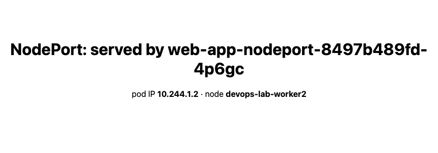

# NodePort — Exposing a Service Outside the Cluster

Exercise `02-nodeport`, run on the same 3-node kind cluster (Kubernetes v1.34.0).

The cluster was created with an `extraPortMapping` for 30080 so the node port is reachable
from macOS — on kind the nodes are containers, so without that mapping the port exists on the
node but nothing on the host can reach it:

```yaml
extraPortMappings:
  - containerPort: 30080
    hostPort: 30080
```

## Deploy

```bash
kubectl apply -f app-deployment.yaml -f service.yaml
kubectl get svc web-service-nodeport
```

```
NAME                   TYPE       CLUSTER-IP      EXTERNAL-IP   PORT(S)        AGE
web-service-nodeport   NodePort   10.96.119.168   <none>        80:30080/TCP   8s
```

## The three ports, which are the whole point

`PORT(S)` reads `80:30080/TCP`, and a NodePort service juggles **three** different numbers:

```
  port (cluster)     : 80        <- the service's own port, for in-cluster clients
  targetPort (pod)   : 80        <- the container port
  nodePort (external): 30080     <- the port opened on EVERY node
  clusterIP          : 10.96.119.168
```

Note it still has a **ClusterIP**. NodePort does not replace ClusterIP — it is a ClusterIP
service *plus* a node-level listener. Internal clients can keep using
`web-service-nodeport:80` and never touch 30080.

## It listens on every node — including nodes with no pods

Two replicas, on two of the three nodes:

```
web-app-nodeport-8497b489fd-4p6gc   10.244.1.2   devops-lab-worker2
web-app-nodeport-8497b489fd-nt6nm   10.244.2.2   devops-lab-worker
```

Then hitting port 30080 on each node's IP:

```
  devops-lab-control-plane   172.20.0.4   pods-here=0  HTTP 200
  devops-lab-worker          172.20.0.3   pods-here=1  HTTP 200
  devops-lab-worker2         172.20.0.2   pods-here=1  HTTP 200
```

**The control-plane node runs zero pods of this app and still answers HTTP 200.** That is the
defining NodePort behaviour: kube-proxy opens the port on *every* node and forwards to a pod
wherever it happens to live. It means an external load balancer can point at any node, or all
of them, without tracking where pods are scheduled.

It also means one hop may be added: a request arriving at `control-plane` has to be forwarded
across the network to a pod on `worker` or `worker2`.

## From the host

```bash
$ curl -o /dev/null -w "HTTP %{http_code}\n" http://localhost:30080
HTTP 200
```



Traffic spreads across both pods, same random selection as ClusterIP:

```
  14 served by web-app-nodeport-8497b489fd-4p6gc
  16 served by web-app-nodeport-8497b489fd-nt6nm
```

## The port range, and why you rarely hardcode it

`nodePort: 30080` was set explicitly here. The default allowed range is **30000–32767**, and
if you omit the field Kubernetes picks a free one for you.

Hardcoding is fine for a lab and a liability in a real cluster: the port is claimed
cluster-wide, so two services cannot both take 30080, and a collision fails the apply. In
practice you either let Kubernetes assign it, or put an Ingress in front and stop exposing
node ports at all.

## Why you would not ship this

- **Ugly URLs.** `http://node-ip:30080`, not `https://app.example.com`.
- **The client needs to know node IPs**, which change as nodes are replaced.
- **No TLS termination, no host or path routing** — it is a layer-4 port forward.
- **The port range is non-standard**, so it usually needs a real load balancer in front
  anyway.

NodePort is best understood as the building block the next two types are made from:
LoadBalancer is NodePort plus an external IP, and Ingress is an HTTP router that itself sits
behind one of those.

## Cleanup

```bash
kubectl delete -f service.yaml -f app-deployment.yaml
```
