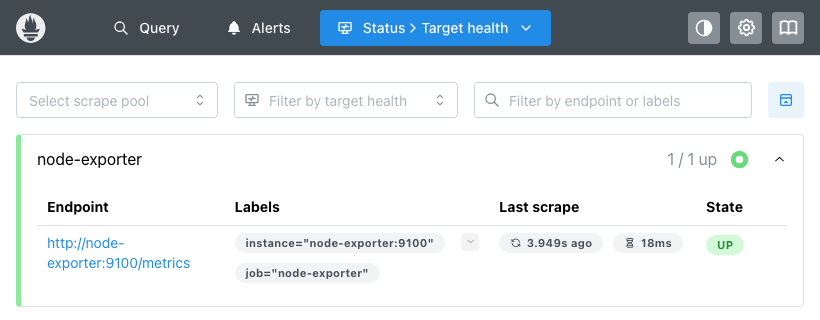

# Monitoring, Observability & GitOps

Session 20. Prometheus, Grafana and node-exporter via Docker Compose; ArgoCD on the 3-node
`kind` cluster, syncing from **this repository on GitHub**.

## Monitoring vs observability

| | Monitoring | Observability |
|---|---|---|
| Answers | "is the thing I expected to break, broken?" | "why is it behaving like this?" |
| Built from | dashboards and alerts on known metrics | high-cardinality data you can slice after the fact |
| Fails when | the failure is one you did not predict | — |

Monitoring is a subset. You monitor **known unknowns** (CPU, error rate, queue depth) and you
need observability for **unknown unknowns** — the question you only think to ask during an
incident. A system is observable if you can answer new questions without shipping new code.

## Metrics, logs and traces

| Pillar | Shape | Cost | Good for | Tool here |
|---|---|---|---|---|
| **Metrics** | numbers over time | cheap, fixed | "is it broken, how badly, trending?" | Prometheus |
| **Logs** | discrete events, text | expensive at volume | "what exactly happened at 14:03?" | `kubectl logs` |
| **Traces** | one request across services | expensive, usually sampled | "which service made it slow?" | — |

The costs differ by orders of magnitude, which drives the usual pattern: **alert on metrics,
diagnose with logs and traces.** A metric tells you the error rate tripled; a trace tells you
which of nine services caused it.

## The stack

```yaml
services:
  prometheus:     { image: prom/prometheus:v3.5.0,      ports: ["9090:9090"] }
  grafana:        { image: grafana/grafana:12.1.1,      ports: ["3300:3000"] }
  node-exporter:  { image: prom/node-exporter:v1.8.2,   ports: ["9100:9100"] }
```

I added **node-exporter**, which the course compose file does not include. Without it
Prometheus only scrapes itself, and every dashboard shows Prometheus's own internals — true but
not illustrative. node-exporter publishes **307 distinct metric families** about the host.

Grafana is on **3300**, not the usual 3000, because another process on this machine already
held 3000:

```
COMMAND   PID     USER     TYPE   NODE NAME
node      67717   Anisha   IPv6   TCP *:3000 (LISTEN)
```

```
Error response from daemon: ports are not available: ... bind: address already in use
```

A port collision is the most common first failure when standing up a local stack, and the fix
is the left-hand side of the mapping — `3300:3000` changes the host port and leaves the
container's own port alone.

## Prometheus pulls, it is not pushed to

```yaml
scrape_configs:
  - job_name: prometheus
    static_configs: [{ targets: ["prometheus:9090"] }]
  - job_name: node-exporter
    static_configs: [{ targets: ["node-exporter:9100"] }]
```

```
  node-exporter    http://node-exporter:9100/metrics  health=up
  prometheus       http://prometheus:9090/metrics     health=up
```



**The pull model is the architectural choice that matters.** Prometheus scrapes targets on a
schedule rather than receiving pushes, which means:

- The **`up` metric is free.** A target that cannot be scraped is `up=0` — you get liveness
  monitoring without the application doing anything.
- An application does not need to know where Prometheus is, or be configured with its address.
- Service discovery decides what exists; in Kubernetes that is the API server, which is why a
  new pod is scraped automatically.

The trade-off is short-lived jobs that finish between scrapes, which is what the Pushgateway
exists for.

## PromQL

```promql
up
  node-exporter=1, prometheus=1

count(node_cpu_seconds_total{mode="idle"})
  15                                   # CPU cores visible

node_memory_MemTotal_bytes/1024/1024/1024
  7.75                                 # GiB

prometheus_tsdb_head_series
  2073                                 # distinct series in memory

max(scrape_duration_seconds)
  0.0221
```

The important one is a **rate**:

```promql
avg(rate(node_cpu_seconds_total{mode="idle"}[1m]))
  0.9783

100 - (avg(rate(node_cpu_seconds_total{mode="idle"}[1m])) * 100)
  2.17                                 # CPU utilisation %
```

`node_cpu_seconds_total` is a **counter** — it only increases, and its absolute value is
meaningless. `rate(...[1m])` converts it to "seconds of idle CPU per second", which is a number
between 0 and 1 per core. Subtracting from 100 gives utilisation.

**Almost every useful Prometheus query is a `rate()` over a counter.** Counters survive
restarts and gaps in a way gauges do not, and `rate` handles the reset. Querying a counter
directly is the most common beginner mistake — the graph just climbs forever.

## Grafana

```bash
$ curl -u admin:admin -X POST http://localhost:3300/api/datasources \
    -d '{"name":"Prometheus","type":"prometheus","url":"http://prometheus:9090","access":"proxy"}'
  Datasource added
```

Confirmed by querying *through* Grafana rather than trusting the UI:

```bash
$ curl -u admin:admin "http://localhost:3300/api/datasources/proxy/1/api/v1/query?query=up"
  job=node-exporter    up=1
  job=prometheus       up=1
```

Note the datasource URL is `http://prometheus:9090` — the **compose service name**, not
`localhost`. Grafana connects from inside the compose network; `localhost` there is Grafana's
own container. The same mistake as binding to `127.0.0.1` in
[`05-docker-fundamentals`](../05-docker-fundamentals/README.md), from the other direction.

`access: proxy` means the browser talks to Grafana and Grafana talks to Prometheus, so
Prometheus never needs to be reachable from the browser.

## GitOps

The deployment model used everywhere else in this repo is **push**: a pipeline holds cluster
credentials and runs `kubectl apply`. GitOps inverts it — an agent **inside** the cluster pulls
from git and reconciles.

| | Push (CI deploys) | Pull (GitOps) |
|---|---|---|
| Credentials | CI holds cluster admin | cluster holds read-only git access |
| Drift | undetected until the next deploy | continuously detected |
| Source of truth | the last pipeline run | the git repository |
| Rollback | re-run an older pipeline | `git revert` |

The credential direction is the strongest argument: **no external system needs cluster admin.**

### ArgoCD, pointed at this repository

```yaml
spec:
  source:
    repoURL: https://github.com/anisha-singhal/devops-homework.git
    targetRevision: main
    path: 19-monitoring-gitops/gitops/app
  syncPolicy:
    automated:
      prune: true        # delete objects removed from git
      selfHeal: true     # revert changes made directly to the cluster
```

```
  t+10s  sync=Synced  health=Healthy

deployment.apps/gitops-demo     2/2
pod/gitops-demo-546d8bc9f9-kx9w4   1/1   Running
pod/gitops-demo-546d8bc9f9-w6drj   1/1   Running
```

Nothing was applied by hand. ArgoCD read the manifests from GitHub and created them.

### Self-heal, measured

`deployment.yaml` in git says `replicas: 2`. Changing the cluster directly:

```bash
$ kubectl scale deployment/gitops-demo --replicas=5
  kubectl scale accepted

  +1s  replicas=5
  +2s  replicas=2      <- reverted
  +3s  replicas=2
```

ArgoCD's own event trail for the same moment:

```
Normal  ResourceUpdated     Updated sync status: Synced -> OutOfSync
Normal  ResourceUpdated     Updated health status: Healthy -> Progressing
Normal  OperationCompleted  Partial sync operation to 9d5818cd... succeeded
Normal  ResourceUpdated     Updated sync status: OutOfSync -> Synced
Normal  ResourceUpdated     Updated health status: Progressing -> Healthy
```

**The manual change survived about one second.** The deployment is pinned to git revision
`9d5818cd`, and anything that disagrees is reverted.

That is the real behavioural difference from a push pipeline, and it cuts both ways: emergency
`kubectl` fixes during an incident get undone too. Either you disable `selfHeal`, or you accept
that the fix has to go through a commit — which is the discipline GitOps is asking for.

`prune: true` is the matching rule in the other direction: delete a manifest from git and
ArgoCD deletes the object. It is also the setting most likely to delete something you wanted,
and it is why the repo path is scoped narrowly to one directory.

## What I took away

- **Prometheus pulls, which is why `up` is free.** Liveness monitoring with no application
  support, and new targets scraped automatically through service discovery.
- **`rate()` over a counter is the whole idiom.** `node_cpu_seconds_total` on its own is
  meaningless; `100 - avg(rate(...idle...[1m]))*100` is CPU utilisation.
- **Grafana reaches Prometheus by compose service name**, not `localhost` — `localhost` inside
  a container is that container.
- **Self-heal reverted a manual change in ~1 second.** GitOps means git is not the record of
  what was deployed, it is the *control input* — and emergency kubectl fixes do not survive.
- **The credential direction is the security argument.** With pull-based GitOps, nothing
  outside the cluster needs cluster admin.
- **Monitoring answers known questions, observability answers new ones.** Alert on metrics
  because they are cheap; diagnose with logs and traces because they are not.

## Cleanup

```bash
cd monitoring && docker compose down -v
kubectl delete -f gitops/argocd-application.yaml
kubectl delete namespace argocd
```
