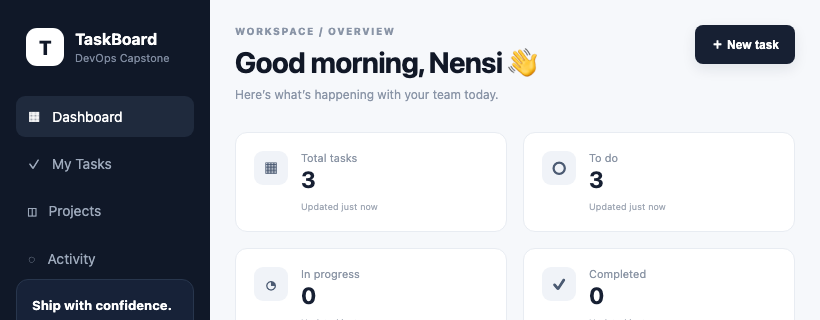

# Final DevOps Project — TaskBoard

Session 21. The capstone: a FastAPI + React + PostgreSQL application taken from source to a
monitored Kubernetes deployment, exercising every earlier session.

**Stack:** React/Vite frontend · FastAPI backend · PostgreSQL · SQLAlchemy + Alembic · pytest ·
Docker Compose · Helm · Kubernetes · HPA

Code in [`taskboard/`](taskboard/).

## M2 — Tests, and a real bug in them

```bash
$ pytest -q --cov=app
FAILED tests/test_api.py::test_create_task_validation - sqlalchemy.exc.Operat...
1 failed, 2 passed
```

```
E   sqlite3.OperationalError: no such table: tasks
E   [SQL: INSERT INTO tasks (title, description, priority, status, assignee, created_at) VALUES (?, ?, ?, ?, ?, ?)]
```

The two tests that passed (`/health`, `/`) touch no database. The one that does, failed.

**Cause** — `app/main.py` creates the schema in a startup handler:

```python
@app.on_event("startup")
def startup():
    Base.metadata.create_all(bind=engine)
```

and `tests/test_api.py` builds its client at module level:

```python
client = TestClient(app)
```

Starlette only fires `startup`/`shutdown` when `TestClient` is used as a **context manager**
(`with TestClient(app) as client:`). As written, the handler never ran, so the table was never
created.

**Fix** — [`tests/conftest.py`](taskboard/backend/tests/conftest.py), a session fixture that
creates the schema once:

```python
@pytest.fixture(scope="session", autouse=True)
def create_schema():
    Base.metadata.create_all(bind=engine)
    yield
    Base.metadata.drop_all(bind=engine)
```

This was preferred over wrapping every test in a context manager because it leaves the existing
tests untouched and states the dependency in one place.

```
3 passed, 3 warnings in 0.29s
TOTAL   120 stmts   24 miss   80% cover
```

**Relying on a framework lifecycle hook to set up test state is fragile** — the hook fires in
production and silently does not in tests.

## M4 — Docker Compose

```
NAME                   STATUS   PORTS
taskboard-backend-1    Up       0.0.0.0:8000->8000/tcp
taskboard-frontend-1   Up       0.0.0.0:3400->80/tcp
taskboard-postgres-1   Up       0.0.0.0:5432->5432/tcp
```

Port 3000 was taken on this machine, which exposed a compose behaviour worth knowing:

```yaml
# docker-compose.override.yml - FIRST attempt, did not work
services:
  frontend:
    ports:
      - "3400:80"
```

```
Error response from daemon: ... bind: address already in use
```

**Compose merges list fields**, so that entry was *appended* to the base file's list and the
stack still tried to bind 3000. The `!override` tag (compose 2.24+) replaces the list instead:

```yaml
services:
  frontend:
    ports: !override
      - "3400:80"
```

An override file is the right tool here — the committed `docker-compose.yml` stays untouched
and the local adjustment is separate.

### End to end

```bash
$ curl http://localhost:8000/health   -> {"status":"UP"}
$ curl http://localhost:8000/ready    -> {"status":"READY"}

$ curl -X POST http://localhost:8000/api/tasks -d '{"title":"Set up CI pipeline",...}'
  created id=1 Set up CI pipeline [HIGH] TODO
  created id=2 Write Helm chart [MEDIUM] TODO
  created id=3 Add Prometheus metrics [LOW] TODO
```

Confirmed in the database rather than trusting the API's own response:

```sql
$ docker compose exec postgres psql -U taskboard -d taskboard -c 'SELECT id,title,priority,status FROM tasks;'
 id |         title          | priority | status
----+------------------------+----------+--------
  1 | Set up CI pipeline     | HIGH     | TODO
  2 | Write Helm chart       | MEDIUM   | TODO
  3 | Add Prometheus metrics | LOW      | TODO
(3 rows)
```



The two probes matter for M8: `/health` is **liveness** (is the process alive) and `/ready` is
**readiness** (can it reach the database). `/ready` runs an actual query — which is exactly the
dependency-checking probe that
[`13-kubernetes-troubleshooting`](../13-kubernetes-troubleshooting/README.md) found missing from
the pod that reported `1/1 Running` while completely broken.

## M8 — Kubernetes + Helm

```bash
docker build -t taskboard-backend:local ./backend
docker build -t taskboard-frontend:local ./frontend
kind load docker-image taskboard-backend:local --name devops-lab
kind load docker-image taskboard-frontend:local --name devops-lab
helm install taskboard ./helm/taskboard -n taskboard -f values-local.yaml
```

`kind load` is required: kind nodes run their own containerd and cannot see the host's Docker
daemon, so a locally built image is simply not there. The chart's defaults point at
`ghcr.io/YOUR_ORG/...`, which does not exist, so
[`values-local.yaml`](taskboard/values-local.yaml) redirects them.

### Both tiers crashed, for different reasons

```
pod/taskboard-frontend-...            0/1   CrashLoopBackOff   1
pod/taskboard-taskboard-backend-...   0/1   CrashLoopBackOff   2
pod/taskboard-postgres-...            1/1   Running            0
```

**Backend** — `exit=1`, and the logs were explicit:

```
sqlalchemy.exc.OperationalError: (psycopg.OperationalError) connection failed:
connection to server at "10.96.174.217", port 5432 failed: Connection refused
```

Postgres was still initialising. The backend has no retry loop, so it died. **It recovered on
its own** once Postgres was ready:

```
  t+15s  taskboard-taskboard-backend-... 1/1 Running 3
```

Three restarts, then healthy. This is Kubernetes' restart backoff doing the job that
`depends_on: condition: service_healthy` did in
[`07-docker-networking-volumes`](../07-docker-networking-volumes/README.md) — **Kubernetes has
no equivalent of that**. The options are an init container that waits for the dependency, a
readiness probe on the dependency, or retry logic in the application. Crash-and-restart works,
but it means a noisy first minute and restart counts that look alarming in a dashboard.

**Frontend** — did *not* self-recover, because it was a configuration error:

```
[emerg] host not found in upstream "backend" in /etc/nginx/conf.d/default.conf:13
```

```nginx
proxy_pass http://backend:8000;    # baked into the image
```

```bash
$ kubectl get svc -n taskboard
  taskboard-frontend
  taskboard-postgres
  taskboard-taskboard-backend      <- the actual name
```

`backend` resolves under Docker Compose, where the service really is called `backend`. Under
Helm the Service is `taskboard-taskboard-backend`, so nginx cannot resolve it and exits
immediately. **A hostname baked into an image is an assumption about the orchestrator**, and it
is why this crashed in one environment and not the other.

(The doubled prefix is itself a chart smell — the template concatenates the release name with a
component name that already includes it.)

Fixed with a ConfigMap rather than an image rebuild:

```yaml
volumeMounts:
  - name: nginx-conf
    mountPath: /etc/nginx/conf.d/default.conf
    subPath: default.conf
```

`subPath` matters: without it the mount replaces the whole `conf.d` directory instead of the
single file.

### Running

```
deployment.apps/taskboard-frontend            2/2
deployment.apps/taskboard-postgres            1/1
deployment.apps/taskboard-taskboard-backend   2/2

NAME                REFERENCE                                TARGETS       MIN   MAX   REPLICAS
taskboard-backend   Deployment/taskboard-taskboard-backend   cpu: 3%/60%   2     6     2
```

Verified through the full chain — browser → frontend nginx → backend Service → Postgres:

```bash
$ kubectl port-forward -n taskboard svc/taskboard-frontend 8800:80

$ curl http://localhost:8800/health
{"status":"UP"}

$ curl -X POST http://localhost:8800/api/tasks -d '{"title":"Deployed via Helm on Kubernetes",...}'
  id=1 Deployed via Helm on Kubernetes [HIGH]
```

That request crossed three Services and two Deployments without touching the backend directly.

## What this project pulled together

| Module | Where it came from |
|---|---|
| M1 app | FastAPI + React + Postgres |
| M2 tests | pytest, 80% coverage — plus a real fixture bug |
| M4 Docker | multi-service compose, override files |
| M5 CI/CD | [`15-cicd-github-actions`](../15-cicd-github-actions/) |
| M6 DevSecOps | [`16-devsecops`](../16-devsecops/) |
| M7 Terraform | [`17-terraform-iac`](../17-terraform-iac/), [`18-cloud-terraform`](../18-cloud-terraform/) |
| M8 K8s + Helm | this page, [`14-helm`](../14-helm/) |
| M9 Observability | [`19-monitoring-gitops`](../19-monitoring-gitops/) |

`taskboard/ci-cd.workflow.yml` is the project's own pipeline, kept as reference rather than
active — this repository already runs its own CI and DevSecOps workflows, and two pipelines
building the same thing would just be noise.

## What I took away

- **The same application broke differently in two environments.** Compose and Kubernetes
  disagreed about one hostname, and only Kubernetes failed. "It works in compose" is not
  evidence it works in the cluster.
- **CrashLoopBackOff is not one problem.** The backend's resolved itself in 45 seconds; the
  frontend's never would have. The exit code and the logs separated them in under a minute —
  the triage order from [`13-kubernetes-troubleshooting`](../13-kubernetes-troubleshooting/).
- **Kubernetes has no `depends_on: service_healthy`.** Crash-and-restart is the default
  dependency mechanism, and it works, but init containers or application-level retries are what
  make startup quiet.
- **A framework lifecycle hook is a fragile place to put test setup** — it fires in production
  and silently does not under `TestClient`.
- **Compose merges lists.** An override that appends is the opposite of what you meant;
  `!override` replaces.
- **A ConfigMap with `subPath` beats rebuilding an image** to change one line of config.

## Cleanup

```bash
helm uninstall taskboard -n taskboard && kubectl delete namespace taskboard
cd taskboard && docker compose down -v
```
